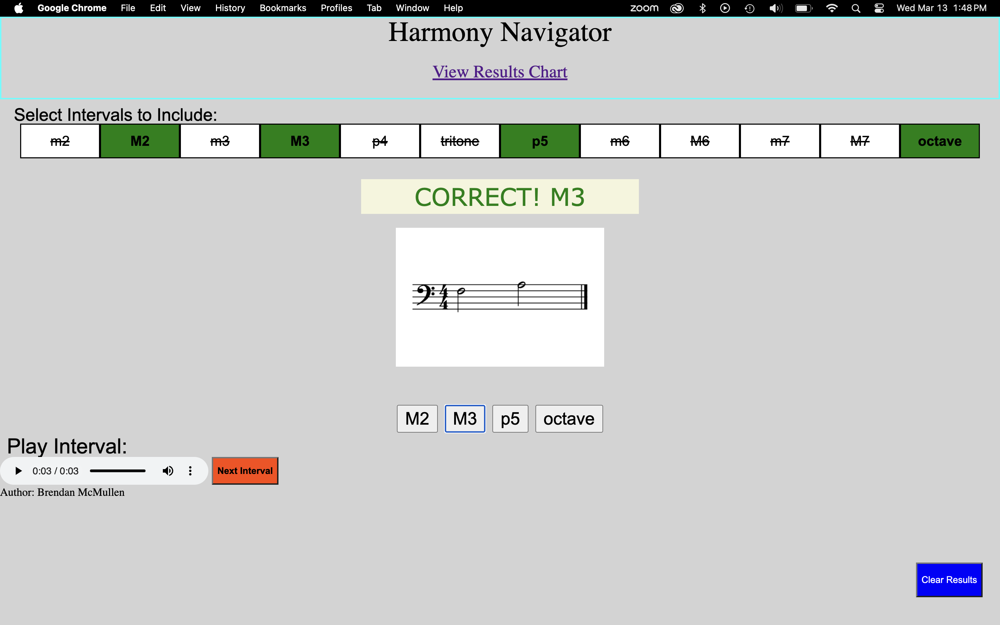
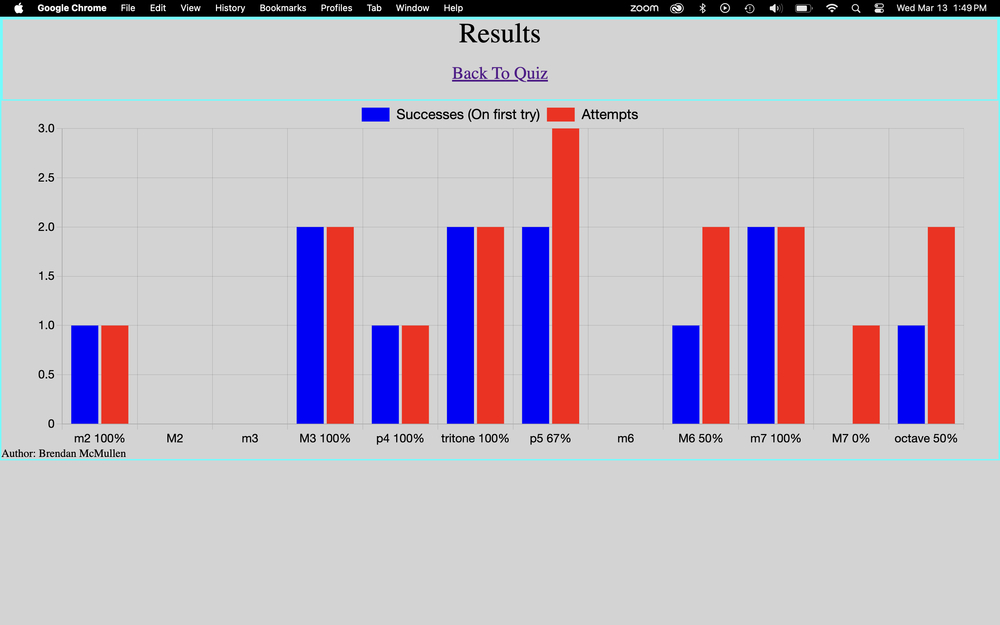

# Harmony Navigator

Harmony Navigator is a web-based tool designed to help users improve their ability to recognize musical intervals by ear. This application allows users to customize their practice by selecting specific intervals to be tested on and provides insightful feedback through a results chart that tracks their progress.

## Features

Customizable Interval Selection: Choose which musical intervals you want to be tested on.
Interactive Testing: Listen to an interval and select the correct answer from the available options.
Detailed Feedback: The results chart shows the number of attempts for each interval and how often you answered correctly on the first try.
Getting Started

You can access the Harmony Navigator website at the following link:
Harmony Navigator

## Instructions
Select Intervals: Start by selecting the intervals you wish to practice by clicking the buttons at the top of the page.\
Test Your Ear: Listen to the interval played and choose your answer from the buttons at the bottom of the screen.\
Next Interval: Click "Next Interval" to hear another interval.\
View Results: At any time, you can select "View Results Chart" to see your performance, including how many attempts you made and your first-attempt accuracy.

  
  

## Technologies Used

GitHub: Version control and hosting.\
VSCode: Code editor for development.\
Sibelius: Music notation software used in the project.\
Logic Pro: Digital audio workstation used for audio processing.

## Author

Brendan McMullen
Software Developer and Music Enthusiast
